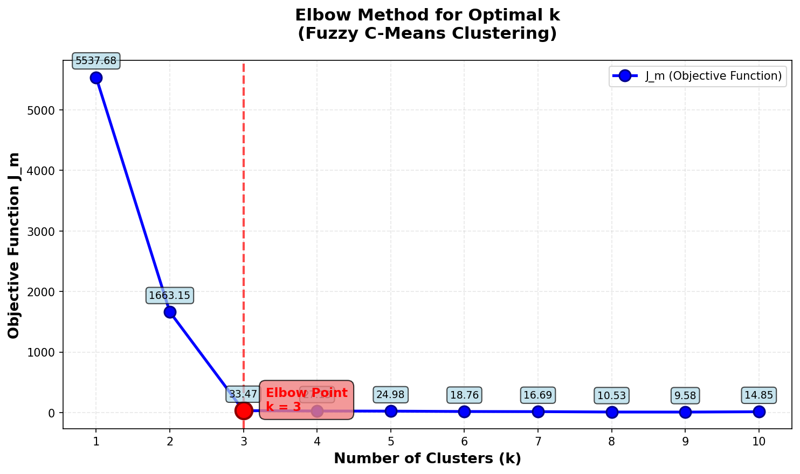

# Spatial Data Structures & Clustering Toolkit

Консольное приложение на языке C и набор Python-скриптов для работы с многомерными пространственными данными. Проект реализует эффективные структуры данных и алгоритмы кластеризации, которые часто применяются в анализе данных, машинном обучении и робототехнике.

## Оглавление

- [Основные возможности](#основные-возможности)
- [Структура проекта](#структура-проекта)
- [Установка и компиляция](#установка-и-компиляция)
- [Использование](#использование)
  - [C-приложение: интерфейс командной строки](#c-приложение-интерфейс-командной-строки)
  - [Python-скрипты для анализа](#python-скрипты-для-анализа)
- [Формат входных данных](#формат-входных-данных)
- [Детали реализации](#детали-реализации)
- [Примеры](#примеры)
- [Лицензия](#лицензия)

## Основные возможности

- **k-d дерево (k-d tree)** — структура данных для организации точек в k-мерном пространстве.
  - Вставка новой точки.
  - Поиск ближайшего соседа с логарифмической сложностью в среднем.
- **Fuzzy C-means (FCM)** — алгоритм нечёткой кластеризации.
  - Вычисляет для каждой точки степень принадлежности к каждому кластеру.
  - Включает вспомогательные метрики для оценки качества: индекс **Xie-Beni**, **Separation Index** и целевую функцию **J_m**.
- **DBSCAN (Density-Based Spatial Clustering of Applications with Noise)** — алгоритм кластеризации на основе плотности.
  - Выделяет кластеры произвольной формы и определяет выбросы (шум).
- **Анализ и визуализация (Python)**
  - `elbow_analysis.py` — скрипт для поиска оптимального числа кластеров для FCM на основе анализа нескольких метрик и визуализации "метода локтя".
  - `cluster_viz.py` — скрипт для наглядной визуализации результатов кластеризации FCM и DBSCAN в 2D.

---

## Структура проекта

| Файл | Описание |
| :--- | :--- |
| `main.c` | Точка входа, интерфейс командной строки и диспетчер команд. |
| `kdtree.c / kdtree.h` | Реализация k-мерного дерева и базовых операций с точками. |
| `fcm.c / fcm.h` | Реализация алгоритма Fuzzy C-Means и метрик для его анализа. |
| `dbscan.c / dbscan.h` | Реализация алгоритма DBSCAN. |
| `elbow_analysis.py` | Python-скрипт для автоматического подбора `k` для FCM (`-cmeans`). |
| `cluster_viz.py` | Python-скрипт для визуализации 2D-кластеризации (`-cmeans` и `-dbscan`). |
| `sample.csv` | Пример файла с тестовыми данными. |

---

## Установка и компиляция

### Требования

- **C-компилятор:** GCC или Clang.
- **ОС:** Linux, macOS, Windows (MinGW/WSL).
- **Python 3.6+** (для скриптов `elbow_analysis.py` и `cluster_viz.py`).
- **Библиотеки Python:** `numpy`, `matplotlib`.

```bash
pip install numpy matplotlib
```

### Компиляция C-программы

Соберите исполняемый файл напрямую через GCC:

```bash
gcc main.c kdtree.c fcm.c dbscan.c -o robot -lm
```

После успешной компиляции в директории появится файл `robot` (или `robot.exe` на Windows).

---

## Использование

### C-приложение: интерфейс командной строки

Общий синтаксис вызова:
```bash
./robot <путь_к_csv_файлу> <команда> [параметры]
```

#### 1. Вставка точки в k-d дерево (`-kd_insert`)

```bash
./robot sample.csv -kd_insert 5.4,3.7
```
**Описание:** Добавляет новую точку с координатами `(5.4, 3.7)` в k-d дерево, построенное на данных из файла. Координаты указываются через запятую без пробелов.

**Вывод:** `Point added`

---

#### 2. Поиск ближайшего соседа (`-kd_nearest`)

```bash
./robot sample.csv -kd_nearest 3.0,4.1
```
**Описание:** Находит ближайшего соседа к заданной точке `(3.0, 4.1)` среди всех точек из CSV-файла, используя построенное k-d дерево.

**Пример вывода:**
```
Nearest point: 3.10 4.20 
Distance: 0.14
```

---

#### 3. Кластеризация Fuzzy C-means (`-cmeans`)

```bash
./robot sample.csv -cmeans 3
```
или с явным указанием коэффициента нечёткости (по умолчанию `2.0`):
```bash
./robot sample.csv -cmeans 3 2.5
```
**Описание:** Запускает алгоритм нечёткой кластеризации FCM, разбивая данные на указанное число кластеров. Выводит центры кластеров, матрицу принадлежности для всех точек и скрытую строку `J_m: <value>`, используемую Python-скриптом для анализа.

**Пример вывода (сокращённо):**
```
Converged at iteration 12 (shift: 8.92e-04 < 1.00e-03)

FCM RESULTS
Clusters: 3, Points: 150, Fuzziness: 2.00
Cluster centers:
  K0: [5.006, 3.428, 1.462, 0.246]
  K1: [5.774, 2.694, 4.389, 1.425]
  K2: [6.812, 3.074, 5.709, 2.049]

Point membership:
  P0: [0.996, 0.002, 0.001]
  P1: [0.973, 0.015, 0.012]
  ...
J_m: 56.342817
```

---

#### 4. Кластеризация DBSCAN (`-dbscan`)

```bash
./robot sample.csv -dbscan 0.5,5
```
**Описание:** Запускает алгоритм кластеризации DBSCAN с параметрами `eps=0.5` и `minPts=5`. Выводит количество найденных кластеров, точки шума и назначение каждой точки.

**Пример вывода (сокращённо):**
```
DBSCAN RESULTS
Found clusters: 2
Noise points: 3
Cluster sizes:
Cluster 1: 72 points
Cluster 2: 75 points

Point assignment:
Point 0 (5.10 3.50 1.40 0.20 ) -> cluster 1
Point 1 (4.90 3.00 1.40 0.20 ) -> cluster 1
Point 2 (7.00 3.20 4.70 1.40 ) -> cluster 2
...
```

---

### Python-скрипты для анализа

#### 5. Метод локтя для FCM (`elbow_analysis.py`)

Автоматически подбирает оптимальное число кластеров `k` для алгоритма FCM. Скрипт запускает C-программу в цикле для `k` от 1 до `k_max`, собирает значения целевой функции **J_m** и определяет точку "локтя" (максимальное замедление убывания функции).

```bash
python3 elbow_analysis.py sample.csv
```
С расширенными параметрами:
```bash
python3 elbow_analysis.py sample.csv 10 2.0
```
**Аргументы:**
- `<csv_file>` — путь к файлу с данными.
- `[k_max]` — максимальное число кластеров для проверки (по умолчанию: 10).
- `[fuzziness]` — коэффициент нечёткости m (по умолчанию: 2.0).

**Результат:** таблица `k` и `J_m` в консоли, а также файл `elbow_method.png` с графиком и отмеченным оптимальным `k`.

<p align="center">
  
</p>

---

#### 6. Визуализация кластеризации (`cluster_viz.py`)

Строит наглядные графики для результатов FCM и DBSCAN. **Важно:** скрипт работает только с 2D-данными (x, y). Для FCM точки окрашиваются по максимальной принадлежности с прозрачностью, пропорциональной уверенности. Для DBSCAN разные кластеры выделяются цветом, шум — серым.

**Примеры использования:**

Визуализация FCM с 3 кластерами:
```bash
python3 cluster_viz.py sample.csv -fcm 3
```

Визуализация DBSCAN с параметрами eps=0.3, minPts=5:
```bash
python3 cluster_viz.py sample.csv -dbscan 0.3,5
```

Сохранение графика в файл:
```bash
python3 cluster_viz.py sample.csv -fcm 4 --save fcm_plot.png
```

---

## Формат входных данных

Входной CSV-файл должен соответствовать следующим требованиям:
- **Разделитель:** запятая (`,`).
- **Содержимое:** только числовые значения (целые или с плавающей запятой).
- **Размерность:** одинаковая для всех точек (все строки должны иметь одинаковое количество столбцов).
- **Без заголовков:** файл не должен содержать строку с названиями колонок.

**Пример валидного файла (`sample.csv`):**
```
5.1,3.5,1.4,0.2
4.9,3.0,1.4,0.2
7.0,3.2,4.7,1.4
6.4,3.2,4.5,1.5
```

